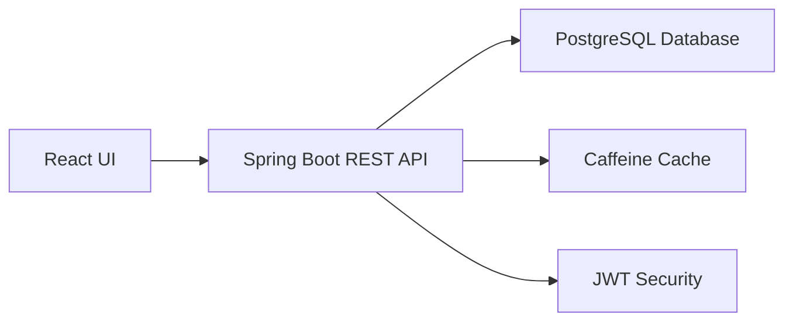

<div align="center">

# 🚀 Unified Billing & Reporting Platform

### Enterprise-Grade Multi-Tenant Billing System for Transportation Operations

**A comprehensive billing and reporting solution designed for multi-client, multi-vendor transportation operations**

[](https://spring.io/projects/spring-boot)
[](https://reactjs.org/)
[](https://www.postgresql.org/)
[](LICENSE)

</div>

---

## 🎥 1. Demo Videos

Experience the platform in action through our comprehensive video walkthroughs:

| Demo | Description | Link |
|------|-------------|------|
| **Complete System Demo** | Full platform overview and core features | [Watch on Loom](https://www.loom.com/share/d4521430b7c64797a8c4994c3c372253) |
| **Billing Processing** | End-to-end billing workflow demonstration | [Watch on Loom](https://www.loom.com/share/a84c34ee84cf4562b54fb65e8afb09d0) |
| **Advanced Features** | Reports, analytics, and role-based access | [Watch on Loom](https://www.loom.com/share/bd68e777aa9849a099153569a18defec) |
| **Technical Deep Dive** | Architecture and implementation details | [Watch on Loom](https://www.loom.com/share/67163804d9ea4c81a16486b8ef2081ff) |

---

## 📐 2. System Overview

**[📹 Watch Architecture Walkthrough](https://github.com/user-attachments/assets/db7cb499-56b1-49f9-807d-6c259b2224fd)**

### Architecture Stack



### Core Components

- **Frontend**: React 18 with modern UI/UX (Dashboard, CRUD Operations, Interactive Reports)
- **Backend**: Spring Boot 3 (REST API, Spring Security, JPA/Hibernate, Caffeine Caching)
- **Database**: PostgreSQL 14+ (Optimized indexes, referential integrity constraints)
- **Architecture**: Layered design - Controller → Service (Business Logic) → Repository (Data Access)
- **Security**: Stateless JWT authentication with Role-Based Access Control (RBAC)
- **Caching**: Caffeine in-memory cache for read-heavy endpoints
- **Billing Engine**: Transactional billing with Strategy Pattern (Package/Trip/Hybrid models)

---

## 📸 3. Application Screenshots

### Dashboard Overview


### Client Management Interface


### Vendor Operations Portal


---

## 🏭️ 4. Architecture & Request Flow
- UI pages call REST endpoints via Axios; responses are DTOs (no JPA entities leaked)
- Controllers are thin; Services encapsulate business logic, `@Transactional` boundaries
- Repositories use derived methods, custom queries, pagination
- HikariCP connection pool; consistent P95 response times on cached reads

Request example (Process Billing):
1. UI calls `POST /api/admin/billing/process/{vendorId}?month=&year=`
2. Security filter validates JWT + ADMIN role
3. Service fetches trips by date range, resolves strategy, computes totals, marks trips processed, persists BillingRecord
4. Returns DTO to UI; Billing Records table updates

---

## 🔐 5. Authentication & Role-Based Access Control
- JWT (HS256) with 24h expiry
- BCrypt password hashing (strength 10)
- Spring Security: `/api/auth/**` is public; all other endpoints require auth
- Method-level RBAC with `@PreAuthorize`

### User Roles & Permissions

| Role | Access Level | Capabilities |
|------|-------------|-------------|
| **ADMIN** | System-wide | Full CRUD operations, billing processing, comprehensive reporting |
| **VENDOR** | Vendor-scoped | View and manage own trips, billing records, and performance reports |
| **EMPLOYEE** | Employee-scoped | Access personal trip history, view assigned routes, track incentives |

---

## 🏢 6. Multi-Tenancy & Data Isolation
This implementation uses tenant-aware scoping at the application layer:
- Data access is scoped by the authenticated user/vendor/client (no cross-tenant reads)
- Role/ownership checks enforced server-side in services/repositories
- Caching keys are entity-ID based and can be extended to include tenant/vendor identifiers if needed (e.g., `tenantId:id`)
- UI reflects isolation via role-based menus and filtered data per user context

Note: No separate schema-per-tenant is created in this codebase; isolation is enforced via access control and query scoping.

---

## 🔌 7. REST API Endpoints
Base URL: `http://localhost:8080/api`

- Auth
  - POST `/auth/login` → issue JWT (PUBLIC)

- Clients (ADMIN)
  - GET `/clients` (ADMIN)
  - GET `/clients/{id}` (ADMIN)
  - POST `/clients` (ADMIN)
  - PUT `/clients/{id}` (ADMIN)
  - DELETE `/clients/{id}` (ADMIN)

- Vendors (ADMIN)
  - GET `/vendors` (ADMIN)
  - GET `/vendors/{id}` (ADMIN)
  - POST `/vendors` (ADMIN)
  - PUT `/vendors/{id}` (ADMIN)
  - DELETE `/vendors/{id}` (ADMIN)

- Employees (ADMIN)
  - GET `/employees` (ADMIN)
  - CRUD (ADMIN)

- Trips
  - GET `/trips` (ADMIN, VENDOR limited to own)
  - GET `/trips?from=&to=&vendorId=` (filters)

- Billing Configurations (ADMIN)
  - GET `/billing-configurations` (ADMIN)
  - PUT `/billing-configurations/{vendorId}` (ADMIN)

- Billing Processing (ADMIN)
  - POST `/admin/billing/process/{vendorId}?month=&year=` (ADMIN)
  - POST `/admin/billing/process-all?month=&year=` (ADMIN)

- Billing Records / Invoices
  - GET `/billing-records` (ADMIN; Vendor sees own)
  - GET `/billing-records/{id}` (by role/ownership)

- Reports
  - GET `/reports/client?clientId=&month=&year=` (ADMIN)
  - GET `/reports/vendor?vendorId=&month=&year=` (ADMIN, VENDOR own)
  - GET `/reports/employee?employeeId=&month=&year=` (ADMIN, EMPLOYEE own)

JWT header on all authenticated calls:
```
Authorization: Bearer <token>
```

---

## 💾 8. Database Schema & Performance Optimization
Core tables: `users`, `clients`, `vendors`, `employees`, `billing_configurations`, `trips`, `billing_records`.

Key integrity rules:
- Foreign keys between vendor/client/employee/trip/billing_records
- Unique constraint to prevent duplicate monthly billing per vendor:
  - `(vendor_id, billing_month, billing_year)` on `billing_records`

Performance indexes (recommended):
```sql
-- Trips filtered by vendor and date range
CREATE INDEX IF NOT EXISTS idx_trips_vendor_date ON trips(vendor_id, trip_date);

-- Optional covering index for common listing columns
CREATE INDEX IF NOT EXISTS idx_trips_cover
ON trips(vendor_id, trip_date) INCLUDE (processed, distance_km, duration_hours);

-- Speed up unprocessed work queues
CREATE INDEX IF NOT EXISTS idx_trips_unprocessed ON trips(vendor_id) WHERE processed = false;

-- Idempotency (avoid duplicate billing)
ALTER TABLE billing_records
ADD CONSTRAINT IF NOT EXISTS uniq_vendor_month_year
UNIQUE (vendor_id, billing_month, billing_year);
```

Diagnostics:
```sql
-- Confirm index usage for monthly vendor queries
EXPLAIN ANALYZE
SELECT * FROM trips
WHERE vendor_id = 1 AND trip_date BETWEEN '2025-11-01' AND '2025-11-30';

-- Table stats (seq vs idx scans)
SELECT relname, seq_scan, idx_scan
FROM pg_stat_user_tables
WHERE relname IN ('trips','billing_records');

-- Keep planner stats fresh
ANALYZE trips;
```

Data inspection helpers: see `VIEW_ALL_DATABASE.sql` and `COMPLETE_SQL_QUERIES_REFERENCE.sql` in the repo.

---

## 📊 9. Query Strategy & Data Access Patterns
- Derived queries (index-friendly): `findByVendorIdAndTripDateBetween(...)`
- Pagination for large lists: `Pageable`, `Page<T>` → `GET /trips?page=&size=`
- DTO projections for reports to reduce payload and serialization cost
- Avoid N+1: fetch joins only where necessary; prefer DTOs on read paths
- Hibernate JDBC batching for bulk updates (`saveAll`) during billing

---

## 💰 10. Billing Engine Architecture
- `BillingStrategy` interface with `Package`, `Trip`, and `Hybrid` implementations
- Factory resolves strategy from `BillingConfiguration`
- Complexity: O(k) over trips for the period; aggregates computed in-service
- Idempotency: service pre-check + DB unique constraint

---

## ⚡ 11. High-Performance Caching Strategy
- Spring Cache abstraction with Caffeine backend
- Caches: `clients`, `vendors`, `employees`, `billingConfigs`
- Policy: `maximumSize=1000`, `expireAfterWrite=30m`, `recordStats()`
- `@Cacheable` on read paths; `@CacheEvict` on mutations
- Effect: Cold GET ~tens of ms → warm GET ~2–5 ms

---

## 🛡️ 12. Security Implementation
- Stateless JWT auth; `SecurityFilterChain` denies all except `/api/auth/**`
- `JwtAuthenticationFilter` extracts and validates tokens per request
- RBAC via `@PreAuthorize` on controllers (ADMIN/VENDOR/EMPLOYEE)
- BCrypt for password storage; CSRF disabled (no cookie sessions)

---

## 🚀 13. Setup & Installation Guide
Prerequisites: Java 17+, Maven, PostgreSQL 14+, Node.js 18+

### Step 1: Database Configuration

Configure PostgreSQL connection in `src/main/resources/application.yml`:
```
spring:
  datasource:
    url: jdbc:postgresql://localhost:5432/moveinsync
    username: postgres
    password: test
  jpa:
    hibernate:
      ddl-auto: update
    show-sql: true
jwt:
  secret: your-256-bit-secret-key-change-this-in-production
  expiration: 86400000
```

### Step 2: Launch Frontend Application

**Windows:**
```
cd C:\Users\abhik\Downloads\billing-platform
npm install
npm run dev   # Vite (dev on http://localhost:5173)
# or if the project uses CRA:
# npm start   # (dev on http://localhost:3000)
```

**macOS/Linux:**
```bash
cd /path/to/billing-platform
npm install
npm run dev   # or: npm start (if CRA)
```

### Step 3: Build & Run Backend

**Windows:**
```bash
cd C:\Users\abhik\Downloads\billing-platform\billing-platform
mvn clean install
mvn spring-boot:run
```

**macOS/Linux:**
```bash
cd /path/to/billing-platform/billing-platform
mvn clean install
mvn spring-boot:run
```

### Step 4: Database Setup & Data Loading

**Option A — Quick Setup (Command Line):**
```bash
psql -U postgres -c "CREATE DATABASE moveinsync;"
psql -U postgres -d moveinsync -f "C:\\Users\\abhik\\Downloads\\billing-platform\\billing-platform\\COMPLETE_SQL_QUERIES_REFERENCE.sql"  # example: run a script
```

**Option B — Interactive Session:**
```bash
psql -U postgres
postgres=# CREATE DATABASE moveinsync;
postgres=# \c moveinsync
moveinsync=# -- Run any SQL file using \i
moveinsync=# \i 'C:\\Users\\abhik\\Downloads\\billing-platform\\billing-platform\\VIEW_ALL_DATABASE.sql'       -- view helpers
moveinsync=# \i 'C:\\path\\to\\your\\seed.sql'                                                -- if you have seed data
moveinsync=# \dt                                                                                     -- list tables
```

**macOS/Linux:**
```
psql -U postgres -c "CREATE DATABASE moveinsync;"
psql -U postgres -d moveinsync -f "/path/to/seed.sql"
# or interactively:
psql -U postgres
postgres=# CREATE DATABASE moveinsync;
postgres=# \c moveinsync
moveinsync=# \i '/path/to/VIEW_ALL_DATABASE.sql'
```

### Default Credentials

| Role | Username | Password |
|------|----------|----------|
| Admin | `admin` | `admin123` |
| Vendor | `swiftcabs` | `vendor123` |
| Employee | `abhikakm` | `employee123` |

### Important Notes
- Schema is auto-managed by Hibernate (`ddl-auto: update`)
- Add `src/main/resources/data.sql` for automatic data loading on startup
- Use `VIEW_ALL_DATABASE.sql` to inspect database contents
- Refer to `COMPLETE_SQL_QUERIES_REFERENCE.sql` for query examples

---

## 🧪 14. Testing & Verification Guide

### Quick Demo Workflow
1. **Authentication**: Login → inspect JWT token in Network tab
2. **Dashboard**: Observe 4 parallel API calls loading data (Clients/Vendors/Employees/Trips)
3. **Cache Performance**: Navigate to Clients page → refresh twice to observe cache speedup
4. **Filtering**: Use Trips page → filter by month/vendor (index-backed queries)
5. **Billing Process**: (ADMIN only) Process billing → verify new Billing Record → retry to demonstrate idempotency
6. **Reporting**: Generate vendor/client/employee performance aggregates

---

## 🛠️ 15. Operational Considerations

### Performance & Monitoring
- **Connection Pool**: HikariCP tuned for consistent P95 latency
- **Logging**: Application logs + SQL query logging (development mode)
- **Error Handling**: Standardized JSON responses via `@RestControllerAdvice`
- **Cache Strategy**: Optional tenant/vendor-specific cache keys for stricter isolation

### Production Readiness Checklist
- [ ] Update JWT secret key in production environment
- [ ] Configure appropriate database connection pool sizes
- [ ] Enable production logging levels
- [ ] Set up monitoring and alerting
- [ ] Review and apply database indexes
- [ ] Configure backup and disaster recovery

---

## 📚 16. Documentation & References
- `PART1_OVERVIEW_UI_DATABASE.md` – UI + DB design + ingestion
- `PART2_SPRINGBOOT_BACKEND.md` – Spring Boot architecture & internals
- `API_ENDPOINTS_GUIDE.md` / `ENDPOINTS_QUICK_REFERENCE.md` – endpoint details
- `VIEW_ALL_DATABASE.sql` / `COMPLETE_SQL_QUERIES_REFERENCE.sql` – SQL helpers

---

<div align="center">

## 🚀 Ready to Get Started?

Follow the [Setup & Installation Guide](#-13-setup--installation-guide) to run the platform locally.

For questions or contributions, please refer to the documentation files in the repository.

---

### 🎯 Key Features Summary

✅ Multi-tenant architecture with role-based access control  
✅ Automated billing with multiple pricing strategies  
✅ High-performance caching with Caffeine  
✅ Comprehensive reporting and analytics  
✅ Secure JWT-based authentication  
✅ Optimized PostgreSQL database with smart indexing  

---

**Built with ❤️ using Spring Boot, React, and PostgreSQL**

© 2025 MoveInSync Billing Platform | Technical Documentation

</div>
